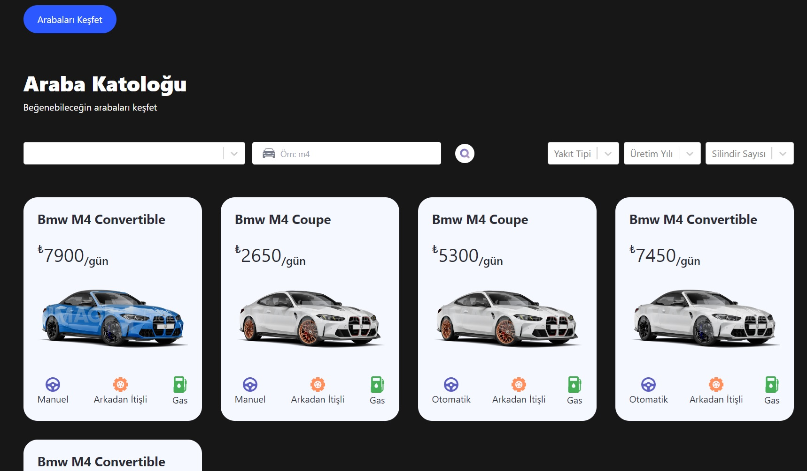

# TypeScript_CarRental_App

This project is a car rental application developed using TypeScript, Framer Motion, React Router DOM, and React Select libraries. The application fetches vehicle data and images from the Cars by API Ninjas and Imagin Studio APIs. It features a responsive and user-friendly interface, allowing users to easily explore their favorite cars. The application includes advanced filtering options by brand, model, fuel type, and year, enabling users to access detailed information about their desired vehicles. Additionally, Tailwind CSS is utilized for responsive designs, and Vite is employed to optimize the development and build processes, resulting in a modern and performant web application focused on scalability and maintainability with clean code practices.

# Libraries Used

-react

-typescript

-react-router-dom

-react-select

-tailwind

-framer-motion

# API

- https://cars-by-api-ninjas.p.rapidapi.com
- https://docs.imagin.studio/guides/getting-images/embedding-in-your-website

# Screenshots

## Gif

# For Live Project

https://car-rental-typescript-murex.vercel.app/
